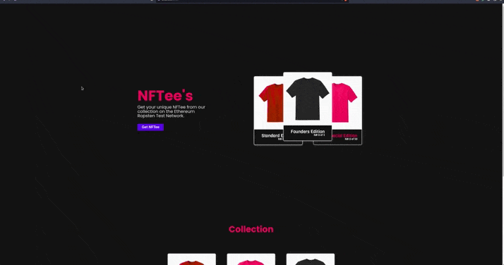

# [NFTee's](https://nftees.web.app/ "Homepage")

NFTee's is a unique NFT website running on top of the Ethereum Ropsten Test Net. You'll need an Ethereum wallet to interact with the website, if you don't have one MetaMask may be a good option.

  

## [Access it here](https://nftees.web.app/ "Homepage")

Check out the contract on EtherScan : https://ropsten.etherscan.io/token/0x550b5c850ecde5c848195e9867e3d41195ddad48?a=0x2ed2c5a08cf6262edec7847f523fa0d622354fab

### What was used

- React.js
- Typescript
- Solidity
- Ethereum Ropsten Test Network
- Factory Pattern
- Firebase Hosting
- Metamask
- Truffle
